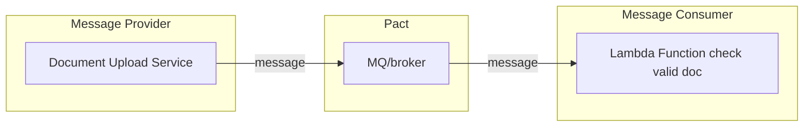
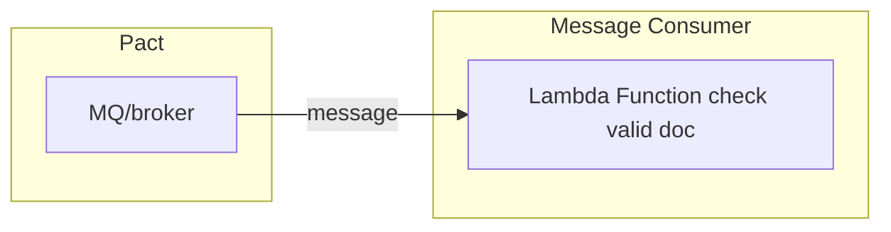
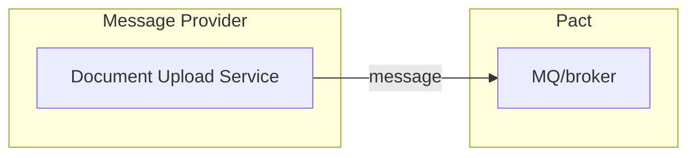

# Introduction

This is an e2e example that uses messages, including a sample implementation of a message handler.

The use case being demonstrated is ????



## Consumer

A Consumer is the system that will be reading a message from a queue or some intermediary. In this example, the consumer is a Lambda function that handles the message.

From a Pact testing point of view, Pact takes the place of the intermediary (MQ/broker etc.) and confirms whether or not the consumer is able to handle a request.


Below is a sample message handler that only accepts that the key `documentType` would only be `microsoft-word`. If not, the message handler will throw an exception (`CustomError`)

<details open>
<summary>MessageHandler and CustomError</summary>

```python
class CustomError(Exception):
    def __init__(self, *args):
        if args:
            self.topic = args[0]
        else:
            self.topic = None

    def __str__(self):
        if self.topic:
            return 'Custom Error:, {0}'.format(self.topic)

class MessageHandler(object):
    def __init__(self, event):
        self.pass_event(event)

    @staticmethod
    def pass_event(event):
        if event.get('documentType') != 'microsoft-word':
            raise CustomError("Not correct document type")
```

</details>

Below is a snippet from a test where the message handler has no error.
Since the expected event contains a key `documentType` with value `microsoft-word`, message handler does not throw an error and a pact file `f"{PACT_FILE}""` is expected to be generated.

<details open>
<summary>Successful test</summary>

```python
def test_generate_new_pact_file(pact):
    expected_event = {
        'documentName': 'document.doc',
        'creator': 'TP',
        'documentType': 'microsoft-word'
    }

    (pact
     .given('A document create in Document Service')
     .expects_to_receive('Description')
     .with_content(expected_event)
     .with_metadata({
         'Content-Type': 'application/json'
     }))

    with pact:
        # handler needs 'documentType' == 'microsoft-word'
        MessageHandler(expected_event)

```

</details>

For a similar test where the event does not contain a key `documentType` with value `microsoft-word`, a `CustomError` is generated and there there is no generated json file `f"{PACT_FILE}"`.

<details open>
<summary>Unsuccessful test</summary>

```python
def test_throw_exception_handler(pact):
    cleanup_json(PACT_FILE)
    wrong_event = {
        'documentName': 'spreadsheet.xls',
        'creator': 'WI',
        'documentType': 'microsoft-excel'
    }

    (pact
     .given('Another document in Document Service')
     .expects_to_receive('Description')
     .with_content(wrong_event)
     .with_metadata({
         'Content-Type': 'application/json'
     }))

    with pytest.raises(CustomError):
        with pact:
            # handler needs 'documentType' == 'microsoft-word'
            MessageHandler(wrong_event)

    progressive_delay(f"{PACT_FILE}")
    assert isfile(f"{PACT_FILE}") == 0
```

</details>

## Provider




```python
import pytest
from pact import MessageProvider

def document_created_handler():
    return {
        "event": "ObjectCreated:Put",
        "documentName": "document.doc",
        "creator": "TP",
        "documentType": "microsoft-word"
    }


def test_verify_success():
    provider = MessageProvider(
        message_providers={
            'A document created successfully': document_created_handler
        },
        provider='ContentProvider',
        consumer='DetectContentLambda',
        pact_dir='pacts'

    )
    with provider:
        provider.verify()
```


### Provider with pact broker
```python
import pytest
from pact import MessageProvider


PACT_BROKER_URL = "http://localhost"
PACT_BROKER_USERNAME = "pactbroker"
PACT_BROKER_PASSWORD = "pactbroker"
PACT_DIR = "pacts"


@pytest.fixture
def default_opts():
    return {
        'broker_username': PACT_BROKER_USERNAME,
        'broker_password': PACT_BROKER_PASSWORD,
        'broker_url': PACT_BROKER_URL,
        'publish_version': '3',
        'publish_verification_results': False
    }

def document_created_handler():
    return {
        "event": "ObjectCreated:Put",
        "documentName": "document.doc",
        "creator": "TP",
        "documentType": "microsoft-word"
    }

def test_verify_from_broker(default_opts):
    provider = MessageProvider(
        message_providers={
            'A document created successfully': document_created_handler,
        },
        provider='ContentProvider',
        consumer='DetectContentLambda',
        pact_dir='pacts'

    )

    with pytest.raises(AssertionError):
        with provider:
            provider.verify_with_broker(**default_opts)

```

# Setup

## Virtual Environment

Go to the `example/message` directory Create your own virtualenv for this. Run

```bash
pip install -r requirements.txt
pip install -e ../../
pytest
```

## Message Consumer

From the root directory run:

```bash
pytest
```

Or you can run individual tests like:

```bash
pytest tests/consumer/test_message_consumer.py::test_generate_new_pact_file
```

## With Broker

The current consumer test can run even without a local broker,
but this is added for demo purposes.

Open a separate terminal in the `examples/broker` folder and run:

```bash
docker-compose up
```

Open a browser to http://localhost and see the broker you have succeeded.
If needed, log-in using the provided details in tests such as:

```
PACT_BROKER_USERNAME = "pactbroker"
PACT_BROKER_PASSWORD = "pactbroker"
```

To get the consumer to publish a pact to broker,
open a new terminal in the `examples/message` and run the following (2 is an arbitary version number). The first part makes sure that the an existing json has been generated:

```bash
pytest tests/consumer/test_message_consumer.py::test_publish_to_broker
pytest tests/consumer/test_message_consumer.py::test_publish_to_broker --publish-pact 2
```
